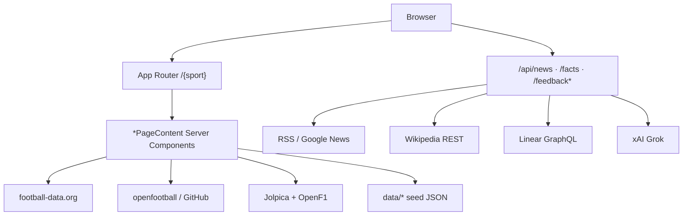

# Motempo Sports — Architecture (Backend view)

## Stack

| Layer | Choice |
|-------|--------|
| Framework | Next.js 15 App Router + React 19 + TypeScript |
| Styling | Tailwind 4 + Radix/shadcn primitives |
| Hosting | Vercel · `sports.motempo.com` |
| Package | `@workspace/motempo-sports` |

Most sports data is **not** exposed as REST. Server Components (`components/sports/*PageContent.tsx`) fetch and stream UI. HTTP BFF routes cover **news, facts, and feedback only**.



---

## Sports registry

**Source of truth:** `lib/sports.ts`

- `CURRENT_SPORT_SLUG` — global default when no last-viewed cookie (`"formula-1"`)
- `SPORTS[]` — id, slug, label, available, SEO fields
- Helpers: `getSportBySlug`, `getCurrentSport`, `buildSportMetadata`, `getSportSitemapEntries`

**Homepage recall:** `middleware.ts` + `lib/last-sport.ts` — essential cookie `motempo-sports-last-sport` set on sport page visits; `/` redirects to that slug (fallback `CURRENT_SPORT_SLUG`). Do not add a permanent `next.config` redirect for `/` (it would cache past the cookie).

**Shared types:** `lib/types.ts` — `MatchInfo`, `MatchStatus`, `MatchStage` (`BracketRound | "GROUP" | "LEAGUE"`), `NewsItem`, `FunFact`, `BracketData`.

---

## HTTP API surface

| Route | Methods | Purpose | Auth |
|-------|---------|---------|------|
| `/api/news` | GET | Paginated RSS news | Public |
| `/api/facts` | GET | Paginated fun facts (+ Wiki enrich) | Public |
| `/api/feedback` | POST | Create Linear issue | Public + IP rate limit |
| `/api/feedback/improve` | GET/POST | Grok availability / rewrite | Public (503 if no key) |
| `/api/feedback/recent` | GET | List recent team issues | **No auth — ops risk** |
| `/api/feedback/close-shipped` | POST | Close shipped tickets | **No auth — ops risk** |
| `/api/feedback/reopen` | POST | Reopen issues | **No auth — ops risk** |

News/facts: `force-dynamic`, `Cache-Control: no-store`.

---

## Data cascade pattern

```
prefer live API → community / open mirror → local seed
```

`MatchDataSource = "api" | "openfootball" | "seed"` (`lib/match-data-source.ts`).

| Sport | Primary | Fallback | Seed |
|-------|---------|----------|------|
| World Cup | football-data `WC` | openfootball worldcup JSON | `data/wc2026-*.json`, `team-seed.json` |
| Premier League | openfootball `en.1.json` (football.json) | football-data `PL` | `data/pl-clubs-seed.json` (+ 3-MD grid) |
| La Liga | openfootball `es.1.json` (football.json) | football-data `PD` | `data/la-liga-clubs-seed.json` |
| Formula 1 | Jolpica Ergast | OpenF1 sessions | `data/f1-season-seed.json` |

Fetch helpers: `lib/fetch-options.ts` (`uncachedFetch`, `freshUpstreamFetch`, cache-bust URLs). No Redis / product Data Cache.

---

## Domain module map (`lib/`)

| Concern | Key files |
|---------|-----------|
| Registry / SEO | `sports.ts`, `types.ts` |
| Football API | `football-data.ts`, `openfootball-data.ts` |
| WC | `wc2026-*.ts`, `group-standings.ts`, `knockout-*.ts`, `tournament-*.ts`, `world-cup-*.ts` |
| F1 | `f1-*.ts` |
| Premier League | `premier-league-*.ts` |
| La Liga | `la-liga-*.ts` |
| Club tables | `league-standings.ts` |
| Schedule / timezone | `match-schedule.ts`, `match-timezone.ts`, `match-status.ts` |
| Forecast copy | `match-forecast.ts` |
| News / facts | `news.ts`, `facts.ts`, `sport-sources.ts` |
| Venues | `match-venue.ts` |
| Ads | `ads-config.ts`, `ad-consent.ts` |
| Feedback | `linear-issues.ts`, `feedback-context.ts`, `rate-limit.ts` |
| Legal | `legal.ts` |

UI shells: `components/sports/{WorldCup,FormulaOne,PremierLeague,LaLiga}PageContent.tsx`.

---

## Cross-sport page shell (standard sections)

Every sport page renders through `SportPageShell` in this order:

1. Header + sport selector  
2. Compact season / tournament rail (title, chips, one intro line)  
3. Ad placement (gated)  
4. Featured next event card (live first, else next match/session)  
5. News + Fun facts  
6. Mid-content ad  
7. Standings, league table, or knockout bracket (one table)  
8. Matches / weekend sessions  
9. How it works primer  
10. Awards / records when implemented  
11. Footer + feedback  

Phase modules: `*-phase.ts`. Guides: `*-guide.ts`.

---

## Environment variables

See `.env.example`. Summary:

| Variable | Role |
|----------|------|
| `FOOTBALL_DATA_API_KEY` | WC / PL / PD + scorers |
| `F1_SEASON` | Override F1 year |
| `GROK_API_KEY` / `XAI_API_KEY` | Feedback improve; optional venue AI |
| `NEXT_PUBLIC_MOTEMPO_APP_ID` | Feedback app id (`sports`) |
| `LINEAR_API_KEY`, `LINEAR_TEAM_*` | Feedback → Linear |
| `COMMIT_SHA` | Deploy fingerprint in issues |
| `NEXT_PUBLIC_ADS_*` | Ad kill switches + provider slots |

---

## Design tokens (founding X-inspired)

Dark default. Key CSS-intent colors from founding plan:

- Canvas `#000` / `#fff`
- Elevated `#16181c` / `#f7f9f9`
- Border `#2f3336` / `#eff3f4`
- Text `#e7e9ea` / `#0f1419`
- Secondary `#71767b` / `#536471`
- Accent `#1d9bf0`

Prefer feed rows over card chrome; no ads inside bracket trees or match cards.

---

## Caching policy (current practice)

| Surface | Policy |
|---------|--------|
| Upstream sports fetches | Prefer `no-store` / busted URLs |
| Sport pages | Often `force-dynamic` / `revalidate = 0` (mixed with content `revalidate = 120`) |
| News/facts APIs | `no-store` |
| In-process | Facts array per sport; Linear IDs; venue Map |

---

## Security notes for backend work

1. Never ship secrets to client components.  
2. Ops feedback routes currently have **no shared secret** — do not expand them without auth.  
3. Rate limit is **per-instance memory** — not durable across serverless isolates.  
4. Ads category blocks are dashboard config, not code.

---

## Related nested app: `oo/`

Private ops dashboard (intended standalone `Motempo/oo`). Consumes Linear issues tagged for sports; plan → approve → implement → `close-shipped`. See `oo/README.md` and `docs/integrations/feedback-linear.md`.
