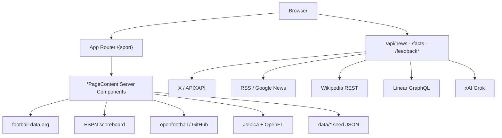

# Motempo Sports — Architecture (Backend view)

## Stack

| Layer | Choice |
|-------|--------|
| Framework | Next.js 15.5.27 (pinned) App Router + React 19 + TypeScript |
| Styling | Tailwind 4 + Radix/shadcn primitives |
| Hosting | Vercel · `sports.motempo.com` |
| Package | `@workspace/motempo-sports` |

`next` and `eslint-config-next` are pinned to **15.5.27** (latest 15.5 security line). Stay on Next 15. `overrides` force `postcss@8.5.28`, `nanoid@3.3.19`, and `sharp@0.35.5`: Next 15.5.27 still depends on PostCSS 8.4.31, and its Sharp range can still resolve 0.34.x.

Most sports data is **not** exposed as REST. Server Components (`components/sports/*PageContent.tsx`) fetch and stream UI. HTTP BFF routes cover **news, facts, and feedback only**.


```mermaid
flowchart TB
  Browser --> Pages["App Router /{sport}"]
  Browser --> APIs["/api/news · /facts · /feedback*"]
  Pages --> SC["*PageContent Server Components"]
  SC --> FD["football-data.org"]
  SC --> ESPN["ESPN scoreboard"]
  SC --> OF["openfootball / GitHub"]
  SC --> JOL["Jolpica + OpenF1"]
  SC --> Seed["data/* seed JSON"]
  APIs --> X["X / APIXAPI"]
  APIs --> RSS["RSS / Google News"]
  APIs --> Wiki["Wikipedia REST"]
  APIs --> Linear["Linear GraphQL"]
  APIs --> Grok["xAI Grok"]
```

---

## Sports registry

**Source of truth:** `lib/sports.ts`

- `CURRENT_SPORT_SLUG` — global default when no last-viewed cookie (`"formula-1"`)
- `SPORTS[]` — id, slug, label, available, `seasonGroup` (`current` | `past`), SEO fields
- Helpers: `getSportBySlug`, `getSportsBySeasonGroup` (A–Z by label), `getCurrentSport`, `buildSportMetadata`, `getSportSitemapEntries`

**Homepage recall:** `middleware.ts` + `lib/last-sport.ts` — essential cookie `motempo-sports-last-sport` set on sport page visits; `/` redirects to that slug (fallback `CURRENT_SPORT_SLUG`). Do not add a permanent `next.config` redirect for `/` (it would cache past the cookie).

**Header picker:** `SportSelector` is a horizontally scrollable rail (same UX as the F1 season calendar): Current season chips, then Last season chips, centred on the active sport. Each season is a labelled group containing a list (the visible label is the accessible name). The active chip sets `aria-current="page"`. Sports that are not available are static text ending in “unavailable”, not disabled controls. The root layout’s “Skip to content” link targets `#main-content` on sport and legal pages.

**Shared types:** `lib/types.ts` — `MatchInfo`, `MatchStatus`, `MatchStage` (`BracketRound | "GROUP" | "LEAGUE"`), `NewsItem`, `FunFact`, `BracketData`.

---

## HTTP API surface

| Route | Methods | Purpose | Auth |
|-------|---------|---------|------|
| `/api/news` | GET | Paginated RSS news (+ image/video enrichment). `limit` is clamped to 1–10 (default 3). Unknown `sport` is 400 | Public |
| `/api/facts` | GET | Paginated fun facts (+ Wiki enrich) | Public |
| `/api/venue-image` | GET | Wikipedia stadium photo for a match venue | Public |
| `/api/feedback` | POST | Create Linear issue | Public + 10/IP/hour |
| `/api/feedback/improve` | GET/POST | Grok availability / rewrite. POST is 10/IP/hour and is checked before any xAI call | GET public; POST rate limited (503 if no key) |

News/facts: `force-dynamic`, `Cache-Control: no-store`. List responses include `items` (and news includes `total`; facts include `total`, `nextOffset`, and `wrapped`). The widgets append each **More** page and render the empty state when the response is not OK, the network fails, or the body is `{ error }`.

---

## Data cascade pattern

```
prefer live API → community / open mirror → local seed
```

`MatchDataSource = "api" | "espn" | "openfootball" | "seed"` (`lib/match-data-source.ts`). Seed payloads are schedules, not invented results. World Cup group seeds stay `SCHEDULED` with null scores; the page labels that state as live data unavailable.

| Sport | Primary | Fallback | Seed |
|-------|---------|----------|------|
| World Cup | football-data `WC` | openfootball worldcup JSON | `data/wc2026-*.json`, `team-seed.json` |
| Premier League | football-data `PL` (current season) | ESPN scoreboard JSON scrape | openfootball `en.1.json` / `.txt` | `data/pl-clubs-seed.json` |
| La Liga | football-data `PD` (current season) | ESPN scoreboard JSON scrape | openfootball `es.1.json` / `.txt` | `data/la-liga-clubs-seed.json` |
| Formula 1 | Jolpica Ergast | OpenF1 sessions | `data/f1-season-seed.json` |

Fetch helpers: `lib/sports-upstream-cache.ts` (`cachedUpstreamFetch`, 90s) for scoreboards and standings. `lib/fetch-options.ts` (`uncachedFetch`) stays on news, facts, and venue photos. No Redis. Shared cache is the Next.js Data Cache (included on Vercel Hobby).

---

## Domain module map (`lib/`)

| Concern | Key files |
|---------|-----------|
| Registry / SEO | `sports.ts`, `types.ts` |
| Football API | `football-data.ts`, `openfootball-data.ts`, `sports-upstream-cache.ts` |
| WC | `wc2026-*.ts`, `group-standings.ts`, `knockout-*.ts`, `tournament-*.ts`, `world-cup-*.ts` |
| F1 | `f1-*.ts` |
| Premier League | `premier-league-*.ts` |
| La Liga | `la-liga-*.ts` |
| Club tables | `league-standings.ts` (Premier League: points, goal difference, goals scored); `la-liga-standings.ts` (La Liga head-to-head mini-table); `league-matchdays.ts` (ESPN/open round numbers; postponements do not renumber later weeks) |
| Schedule / timezone | `match-schedule.ts`, `match-timezone.ts`, `match-status.ts`, `hooks/use-viewer-time-zone.ts` |
| Forecast copy | `match-forecast.ts`, `featured-match-copy.ts`, `next-event-copy.ts` |
| News / facts | `news.ts`, `news-media.ts`, `google-news.ts`, `facts.ts`, `sport-sources.ts` |
| Venue photos | `venue-image.ts` |
| Venues | `match-venue.ts` — local stadiums first; at most 4 football-data match-detail calls per World Cup render |
| Ads | `ads-config.ts`, `ad-consent.ts` |
| Feedback | `linear-issues.ts`, `feedback-context.ts`, `rate-limit.ts` |
| Legal | `legal.ts` |

UI shells: `components/sports/{WorldCup,FormulaOne,PremierLeague,LaLiga}PageContent.tsx`.

### Viewer timezone and hydration

Vercel runs the app in UTC. Formatting a kickoff with `toLocaleString` or `Intl.DateTimeFormat().resolvedOptions().timeZone` during render uses that zone on the server and the viewer's zone in the browser, so React hydrates mismatched clocks and day columns.

Client schedules keep the server HTML and the hydration render on an explicit UTC zone (`HYDRATION_TIME_ZONE` in `lib/match-timezone.ts`, `useViewerTimeZone`). After paint, the hook switches to the browser zone and regroups:

- Football day columns: `ScheduleByDay` (Premier League, La Liga, World Cup)
- Session day columns: `WeekendSessionsByDay` (Formula 1)
- Featured kickoffs: `FeaturedMatchCard`, `FormulaOneNextEvent`
- Bracket / match-card kickoffs: `BracketMatchCard`, `MatchCard`

Until that switch the caption reads "Times in UTC". Afterwards it reads "Times in your local timezone" (it stays "Times in UTC" when that is the viewer's zone). Clock columns are wide enough for `12:00 PM` on one line so the swap does not wrap the row.

The standings **Updated** line is the server render time. `formatUpdatedTime` always prints an explicit zone (`3:45 PM UTC`) and is not rewritten on the client.

Civil dates stored as `YYYY-MM-DD` (F1 round days, not kickoff instants) use `formatCalendarDate`, which pins `timeZone: "UTC"` so the labeled day does not shift.

---

## Cross-sport page shell (standard sections)

Every sport page renders through `SportPageShell` in this order:

1. Header + sport selector  
2. Compact season / tournament rail (title, chips, one intro line)  
3. Ad placement (gated)  
4. Featured next event card (live first, else next match/session) — three paragraphs plus a circuit/stadium photo (half-width on large screens, below the text on narrow screens)  
5. Matches / weekend sessions — finished football fixtures open a modal with the same next-match card (score, copy, stadium photo)  
6. News + Fun facts  
7. Mid-content ad  
8. Standings, league table, or knockout bracket (one table)  
9. How it works primer  
10. Awards / records when implemented  
11. Footer + feedback  

Phase modules: `*-phase.ts`. Guides: `*-guide.ts`.

---

## Environment variables

See `.env.example`. Summary:

| Variable | Role |
|----------|------|
| `FOOTBALL_DATA_API_KEY` | WC / PL / PD + scorers |
| `F1_SEASON` | Override F1 year |
| `APIXAPI_KEY` | Optional ApiTwitter key for live X news (`APITWITTER_API_KEY` alias) |
| `GROK_API_KEY` / `XAI_API_KEY` | Feedback improve; optional venue AI |
| `NEXT_PUBLIC_MOTEMPO_APP_ID` | Feedback app id (`sports`) |
| `LINEAR_API_KEY`, `LINEAR_TEAM_*` | Feedback → Linear |
| `COMMIT_SHA` | Deploy fingerprint in issues |
| `NEXT_PUBLIC_ADS_*` | Ad kill switches + provider slots |

---

## Design tokens (founding X-inspired)

Dark default. Key CSS-intent colors from founding plan:

- Canvas `#000` / `#fff`
- Elevated `#16181c` / `#f7f9f9`
- Border `#2f3336` / `#eff3f4`
- Text `#e7e9ea` / `#0f1419`
- Secondary `#71767b` / `#536471`
- Accent `#1d9bf0`

Prefer feed rows over card chrome; no ads inside bracket trees or match cards.

---

## Caching policy

Sport pages stay `dynamic = "force-dynamic"` so the shell renders per request (the 3-minute `router.refresh()` still feels live). They must **not** set `fetchCache = "force-no-store"` or `revalidate = 0` — `force-no-store` skips Data Cache reads.

Upstream sports payloads (football-data, ESPN scoreboards, openfootball / GitHub raw, Jolpica, OpenF1, scorers) go through `cachedUpstreamFetch`:

| Layer | What it does |
|-------|----------------|
| In-process map | Dedupes concurrent misses on one isolate; repeat hits in the same 90s window do not call out |
| `unstable_cache` time bucket | Shared Next.js Data Cache across Hobby isolates. The bucket id changes every 90s, so the first request of the next window **blocks** on a fresh upstream read (a full-time result shows up within one TTL, not one extra stale-while-revalidate hop) |
| What is stored | HTTP **200** bodies only. A 429 (or any other status) is not written. That request still falls through the cascade (football-data → ESPN → openfootball → seed). The next request tries football-data again. ESPN boards are trimmed before storage so they stay under the Data Cache 2MB entry cap |

GitHub raw URLs are **not** cache-busted with `?_=`. News, facts, and venue-photo fetches stay `no-store`.

`'use cache'` / Cache Components is the Next 16 model and would change rendering for the whole app on 15.5, so it is not enabled. An in-memory map alone is not shared across isolates.

| Surface | Policy |
|---------|--------|
| Upstream sports fetches | 90s Data Cache via `cachedUpstreamFetch`; non-200 not stored |
| Scheduled refresh | None. The window id rolls every 90s, and Hobby cron runs at most once a day, so a cron cannot keep these entries warm |
| Sport pages | `force-dynamic` (per-request HTML). No `fetchCache = force-no-store` |
| News/facts APIs | `no-store` |
| In-process | Sports-cache window map; facts array per sport; Linear IDs; venue Map |

---

## Dialogs and notices

Match details, news stories, and fun facts open `components/ui/ExpandableModal.tsx`, a modal Radix Dialog. Opening moves focus to the close control, Tab stays inside the dialog (including the scrollable body), and Escape or Close returns focus to the fixture or feed row that opened it. The visible heading is the dialog title. The panel stays a bottom sheet on small screens and a top-aligned card from the `sm` breakpoint, with a short fade.

The cookie notice (`components/legal/CookieNotice.tsx`) is not a dialog. It does not block the rest of the page, so it is a named region (`<section aria-label="Cookie notice">`). It does not move or trap focus; visitors reach it as a landmark.

Bug reports keep the separate shadcn dialog in `components/ui/dialog.tsx`.

---

## Security notes for backend work

1. Never ship secrets to client components.  
2. Public `POST /api/feedback` stays unauthenticated and rate-limited. The app does not expose routes to list, close, or reopen Linear issues.  
3. Rate limit is **per-instance memory** — not durable across serverless isolates. `POST /api/feedback` and `POST /api/feedback/improve` each allow 10 requests per client per hour. The bucket key is the platform client IP: the rightmost hop of `x-vercel-forwarded-for`, then `x-real-ip` (the address `@vercel/functions` `ipAddress()` reads). A client-supplied `x-forwarded-for` is not a key, so a spoofed first hop cannot open a new bucket.  
4. `POST /api/feedback` 500 responses are a generic message. Linear GraphQL text is logged on the server and is not copied into the response.  
5. Screenshot uploads accept only an allowlist of image MIME types (`lib/screenshot-mime.ts`). The client-supplied `Content-Type` is not forwarded otherwise.  
6. Ads category blocks are dashboard config, not code.  
7. News article fetches follow redirects manually (`lib/safe-http.ts`, max 5) and refuse loopback, private, link-local, metadata, and unique-local targets, including IPv4-mapped IPv6 and non-canonical numeric IPv4. Hostnames that resolve to those addresses are not requested.  
8. AdSense site ownership is the `google-adsense-account` meta tag. `adsbygoogle.js` is not on the page until the visitor accepts ad cookies and the ad kill switches are on.  
9. **Browser headers** (`lib/security-headers.ts`, applied from `next.config.ts` on every route):
   - Enforcing: `Referrer-Policy: strict-origin-when-cross-origin`, `X-Frame-Options: DENY`, `X-Content-Type-Options: nosniff`, and a restrictive `Permissions-Policy` (camera, mic, geolocation, payment, and similar features disabled; fullscreen / picture-in-picture / encrypted-media only for this origin plus YouTube and Vimeo embeds).
   - `Content-Security-Policy-Report-Only` (not enforcing yet). It allows same-origin fetches (news, facts, venue photos, feedback), inline scripts Next.js plus the theme and consent snippets need, `'unsafe-inline'` styles, and `https:` images and media so crests, flags, Wikimedia, and publisher CDNs still load. Script, connect, and frame sources allow the Google AdSense / consent hosts and NitroPay in addition to `'self'`.
   - Do not promote that policy to enforcing `Content-Security-Policy` until a session with live ad placements and ad consent is clean. Google does not support a fixed AdSense host allowlist, and the strict nonce policy they do support requires `'unsafe-eval'`. See [integrations/ads.md](./integrations/ads.md).

---

## CI

Pull requests and pushes to `main` run [`.github/workflows/ci.yml`](../.github/workflows/ci.yml):

`npm ci` → `npx tsc --noEmit` → `npm run lint` → `npm run build` → `npm test`

No API keys or other secrets are required. `npm test` uses Node's built-in runner (`node:test` with type stripping) on `lib/**/*.test.ts`. Tests stay offline — they call pure helpers and must not request ESPN, football-data, or other upstreams. `scripts/node-test-alias-hook.mjs` resolves the `@/*` alias and stubs `server-only` plus `next/cache` so those modules load outside the Next.js bundler. Sport pages are `force-dynamic`, so `next build` does not fetch upstream data.

---

## Related nested app: `oo/`

`oo` was a private ops dashboard and the only caller of the sports feedback ops routes (`recent`, `close-shipped`, `reopen`). Those routes are removed. Sports feedback still creates Linear issues through public `POST /api/feedback`. See `docs/integrations/feedback-linear.md`.
